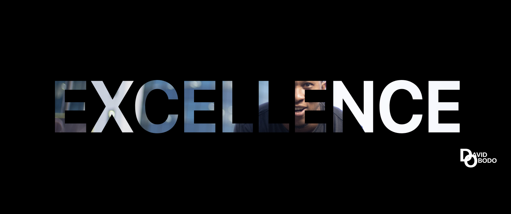

<h1 >Hello 👋</h1>

<!-- 
<h3 align='center'><strong><a href="https://ahmad-sawalqeh.github.io/my_resume/" target="_blank">Portfolio🌐</a></strong></h3> -->

Certainly what I strive for in all I do, well who doesn't love things done excellently 😅

<h3>
What happened the the other day
</h3>

Me: In love with all things Typescript
My Brain: No it's Javascript
Me: But it's typescript we mostly write ?
My Brain: Its Just Javascript with types, so you should actually tell them its Javascript
Me: But they are still different now ?
My Brain: C'mon let's not do this all day 😫. If you are being sincere with them we actually write even mofe than just the typescript you are talking about.
Didn't we spend a huge chunk of our time converting a design into pixel perfect pages with HTML, CSS & SASS ?
And even though React.js and Next.js are frameworks haven't we spent a lot of time building enterprise grade applications but personally and with teams using them ?
Don't even get me started on the various amount of times we have used Jest and React Testing Library to write tests  
Me: But what you are doing now, is mentioning frameworks and tools built with the language, I was only telling them about the language 😤
My Brain: We had this discussion last night, to stil tell them about the various frameworks we've used and are now using
Me: But we didn't reach a conclusion because they are a lot. In Frontend there's still Chakra UI, Styled Components, Semantic UI, Bootstrap, React Query, Redux, GraphQL, GSAP, Material UI, Three.js, Tailwind CSS, Storybook even old man JQuery. Thereafter let's not forget backend where we used Express.js, Node.js, Mongo DB, GCP and since you are always curious you even went along to start learning Solidity and Web3 stuffs.
All I'm saying is that we can't list all the frameworks here, cause they keep growing since technology keeps evolving
My Brain: Whatever you say 😤

Please Ignore my brain, always acting up sometimes. You can check my portfolio for dome of my detailed works.    

<!-- 

  

 -->

 

[Check out my blog](https://blog.davidobodo.com/)

My Brain: Why didn't you also use a fancy sheild image for your blog like you did for Twitter and Linkedin
Me: Cause shield https://shields.io/ didn't have one
My Brain: Then create it for them 😤
Me: Really 😳😳😳😳
